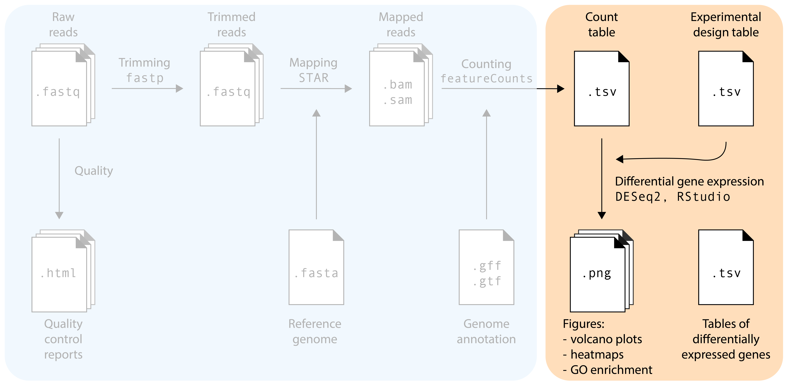

The main goal of most RNA-seq experiments is to discover which genes are differentially expressed between different groups (treatments, tissues, genotypes): the list of differentially expressed genes (DEGs). After the previous section, we now have a count table with the number of reads that map to each gene in each sample. How do we get to our goal from this table? We will need to use statistical models! In this section, we will use the `DESeq2` package in `R` for differential gene expression analysis. Several other packages with different statistical models and assumptions exist (e.g. `EdgeR` and `Limma`): we pick `DESeq2` because it is robust, widely-used, and user friendly.

## Reading the count table into DESeq2

In this tutorial, we will explore the transcriptomes of root samples of *Arabidopsis thaliana* plants that were treated with different plant hormones. Control samples were not treated with any plant hormone. The experimental design is simple: there are three replicates in each condition: `control` (no hormone), `aba` (abscisic acid), `meja` (methyl-jasmonate), `acc` (the precursor of the hormone ethylene), and `auxin`.

::: {.callout-note}
Download the data from [the repository of this workshop](https://github.com/mishapaauw/RNA-seq-workshop/tree/main/data). Store the files in a folder on your computer. See below for a good workshop folder setup:

```{bash}
#| eval: FALSE
RNA-seq-workshop
├── data/
│   ├── Deforges_2019-raw-counts.csv
│   └── Deforges_2019-experiment-design.csv
├── data_processed/
│   └── Normalized counts will go here
├── results/
│   └── Graphs will go here
└── RNA-seq.R
```
:::


First we will load the packages that we need:

```{R filename = "R"}
#| warning: false
set.seed(1992)

library(DESeq2)
library(tidyverse)
library(ggrepel)
```

Then, load the count table and metadata file:

```{R filename = "R"}
raw_counts <- read.csv("data/Deforges_2019-raw-counts.csv", header = T, stringsAsFactors = F) # <1>

raw_counts <- raw_counts %>% column_to_rownames("Geneid") # <2>

metadata <- read.csv("data/Deforges_2019-experiment-design.csv", header = T)

raw_counts[1:4,1:4]
```
1. Make sure you use the correct path to where your data is stored. Depending on your folder structure, you may need to adapt the filepath. Here, we use: `data/Deforges_2019-raw-counts.csv`.
2. Here, we store the column `Geneid` as row names instead of a dedicated column.

That looks good! Now, it's important to note that `DESeq2` expects the sample names (columns in count table) to *exactly match* the sample names in the metadata file, and be in the *same order*! For this small dataset, we can inspect that by eye. In addition, and probably useful for larger datasets, we can use the `all()` function to check this.

```{R filename = "R"}
head(metadata)
```

```{R filename = "R"}
all(colnames(raw_counts) == metadata$sample) # <1>
```
1. If this does not return `TRUE`, you need to reorder or rename sample names in one of your files. 

### Creating the `dds` object

We are now ready to create a `DESeqDataSet` object, commonly abbreviated as `dds`. The `dds` object will contain our count tables and metadata, but later, also the normalized counts and differentially expressed gene lists. As such, the `dds` objects help us keep things neat in our RStudio session. To make one, we need to specify our experimental design 'formula'. In this tutorial, there's only one variable: the design formula will be as simple as `~ condition`. However, in multi-factor experiments it can include additional experimental variables, but also include unwanted sources of variation such as RNA isolation batch. Including these factors in the design formula will help DESeq2 to account for these soures of variation, allowing more accurate estimation of the primary condition’s effect. For example, in an experiment with a potential batch effect, treatments, and different genotypes: `~ batch + treatment + genotype`. If you also want to model the *interaction*, that is whether the treatment effect varies by genotype, change the `+` to a `*`: `~ batch + treatment * genotype`.

```{R filename = "R"}
dds <- DESeqDataSetFromMatrix(countData = raw_counts, 
                              colData = metadata, 
                              design = ~ condition)
```

## Inspecting sample clustering via PCA

As essential step in RNA-seq analysis is to inspect similarity between samples. In particular, we should confirm that **replicates with the same treatment are similar to each other**, and make sure that **the experimental condition is the major source of variation in the data**. In addition, these quality-control explorations will also help identify if any samples behalve as outliers, or whether there may have been a sample swap. We will use **Principal Component Analysis (PCA)** to do this. PCA is a dimensionality reduction technique that transforms complex high-dimensional data (like expression of thousands of genes) into a limited number of new variables ('principal components') that capture the most variation in the dataset. 

### Performing variance stabilization

Before performing the PCA itself, we need to take an import feature of RNA-seq data into account: the variance of a gene is strongly correlated to the expression level of the gene. In statistics language, our data is **not homoscedastic**, while PCA assumes homoscedastic data. We can solve this by performing a variance stabilizing transformation `vst()`:

```{R filename = "R"}
variance_stabilized_dataset <- vst(dds, blind = TRUE)
```

Let's inspect the average expression and standard deviation of each gene to show that this transformation worked. In the following plots, each dot represents one *A. thaliana* gene:

```{R filename = "R"}
#| code-fold: true
#| code-summary: "Show the code to make the plots"
library(patchwork)

without_vst <- raw_counts %>% 
    as.data.frame() %>% 
    rownames_to_column("gene") %>% 
    pivot_longer(cols = - gene, names_to = "sample", values_to = "count") %>% 
    group_by(gene) %>% 
    summarise(gene_mean = mean(count), gene_sd = sd(count)) %>% 
    ungroup() %>% 
    ggplot(aes(x = log10(gene_mean), y = log10(gene_sd))) +
    geom_point(alpha = 0.2) +
    labs(x = "Gene count average\n(log10 scale)",
        y = "Gene count standard deviation\n(log10 scale)") +
    ggtitle("No variance stabilization")
    
variance_stabilised_counts <- assay(variance_stabilized_dataset)

with_vst <- variance_stabilised_counts %>% 
  as.data.frame() %>% 
  rownames_to_column("gene") %>% 
  pivot_longer(cols = - gene, names_to = "sample", values_to = "count") %>% 
  group_by(gene) %>% 
  summarise(gene_mean = mean(count), gene_sd = sd(count)) %>% 
  ungroup() %>% 
  ggplot(aes(x = log10(gene_mean), y = log10(gene_sd))) +
  geom_point(alpha = 0.2) +
  labs(x = "Gene count average\n(log10 scale)",
       y = "Gene count standard deviation\n(log10 scale)") +
  ggtitle("Variance stabilized")

without_vst | with_vst

variance_stabilised_counts_df <- variance_stabilised_counts %>%
  as.data.frame() %>% 
  rownames_to_column("gene")  

write.csv(variance_stabilised_counts_df, "data_processed/variance_stabilized_dataset.csv", row.names=FALSE)
```
Indeed, we can observe that genes that are highly expressed (have high mean count) also have a high standard deviation. This correlation is no longer there after stabilizing the variance.

### Performing the PCA

Okay, finally we are ready to perform the PCA. `DESeq2` makes this very easy for us with a simple function, `plotPCA()`, which directly gives us a PCA plot. 

```{R filename = "R"}
#| warning: false
plotPCA(variance_stabilized_dataset)
```

Let's break this plot down:

- We see that principal component 1 (`PC1`) explains 61% of the variance, while `PC2` explains 27%. 
- `PC1` separates the `aba` samples from all other conditions. 
- `PC2` separates `meja` and `auxin` treated sampled from the `control` samples, both in a different direction.
- `acc` treated samples seem to cluster together with `control` samples. So it looks like the impact of `acc` on the Arabidopsis transcriptome is limited.
- Different replicates from the same treatment plot close together in PCA space: that's good news.

If you want to have full control and make the PCA plot yourself in `ggplot2`, you can add `returnData=TRUE)`. You can then save the PCA coordinates in a dataframe, ready for manual plotting.

```{R filename = "R"}
#| eval: false
pca_data <- plotPCA(variance_stabilized_dataset, returnData=TRUE) 
```

While it is impossible to give examples of all situations that can occur in PCAs, we highlight a few below in fake PCA plots:

```{R filename = "R"}
#| code-fold: true
#| code-summary: "Show the code to make the plots"

df_swap <- data.frame(
  PC1 = c(rnorm(5, mean = 1, sd = 0.2),   
          rnorm(5, mean = -2, sd = 0.2)), 
  PC2 = c(rnorm(5, mean = 0.4, sd = 0.2),
          rnorm(5, mean = 0.3, sd = 0.2)),
  genotype = c(rep("WT", 4), "mutant", rep("mutant", 4), "WT"))

df_weak_sep <- data.frame(
  PC1 = c(rnorm(5, mean = 0.2, sd = 0.45),   
          rnorm(5, mean = 0, sd = 0.6)), 
  PC2 = c(rnorm(5, mean = 0, sd = 0.25),
          rnorm(5, mean = 0, sd = 0.25)),
  genotype = rep(c("WT", "mutant"), each = 5)
)

p1 <- df_swap %>% ggplot(aes(x = PC1, y = PC2, colour = genotype)) + geom_point() +
  xlab("PC1 (48%)") +
  ylab("PC2 (13%)") +
  ggtitle("Sample swap")

p2 <- df_weak_sep %>% ggplot(aes(x = PC1, y = PC2, colour = genotype)) + geom_point() +
    xlab("PC1 (12%)") +
    ylab("PC2 (4%)") +
    ggtitle("Weak separation")

p1 | p2
```

In the first plot, we see one WT sample clustering with mutant samples, and vice versa. This is a clear indication that two samples were swapped somewhere in the process: during sampling, RNA extraction, cDNA synthesis, library prep, or in the metadata file. If you can trace this back in your labjournal, you could swap the sample label back. If not... it's probably better to discard these two samples completely. In the second plot, we can see that there's no clear separation between WT and mutant samples. In addition, the two PCs explain little of the variance present in the dataset. This is an indication that the genotype actually has little impact on the transcriptome. While worrying, this does not mean that all is lost! You can still proceed to differential expression analysis, maybe the difference between the two genotypes is quite subtle. 

```{R filename = "R"}
#| code-fold: true
#| code-summary: "Show the code to make the plots"
df_confounding_1 <- data.frame(
  PC1 = c(rnorm(5, mean = 1, sd = 0.45),   
          rnorm(5, mean = -1, sd = 0.6)), 
  PC2 = c(rnorm(5, mean = 0, sd = 0.25),
          rnorm(5, mean = 0, sd = 0.25)),
  genotype = rep(c("WT", "mutant"), each = 5),
  gender = rep(c("male", "female"), each = 5)
)

p1 <- df_confounding_1 %>% ggplot(aes(x = PC1, y = PC2, colour = genotype)) + geom_point() +
  xlab("PC1 (48%)") +
  ylab("PC2 (13%)") +
  ggtitle("Genotype effect ...")

p2 <- df_confounding_1 %>% ggplot(aes(x = PC1, y = PC2, colour = gender)) + geom_point() +
  xlab("PC1 (48%)") +
  ylab("PC2 (13%)") +
  ggtitle("... or gender effect?")

p1 | p2
```

In this example, we see separation of our wildtype and mutant samples. Experiment succesful! ... or is it? Upon closer inpection, we can see that gender of our samples also separates our samples in the same way. It turns out that all wildtypes were male mice, and all mutants were female. We will therefore never know if differentially expressed genes are caused by the genotype, or simply by the gender of the mice: a clear case of confounding variable. This is an experimental design flaw, and should have been caught before sampling. Yet, it happens!

::: {.callout-tip title="Question" icon="false"}
Besides PCA, how else could you assess whether replicate samples from the same treatment show similar results?
:::

::: {.callout-caution title="Solution" collapse="true" icon="false"}
We can use a correlation analysis to do this. For this analysis, we will also need the variance stabilized counts.

```{R filename="R"}
library(pheatmap)

correlation_matrix <- cor(variance_stabilised_counts)

metadata_2 <- metadata %>% column_to_rownames("sample")

pheatmap(correlation_matrix, annotation_row = metadata_2, 
         clustering_distance_rows = "correlation", 
         clustering_distance_cols = "correlation", 
         display_numbers = TRUE, fontsize = 7)
```
- We can see that all the replicate samples with the same treatment cluster together,  For example, `aba` samples have a 0.99 correlation with each other, while they have a slightly lower correlation to samples with a different treatments. 

- Just like in the PCA `control` and `acc` samples cluster together, indicating that there is little impact of `acc` treatment on the transcriptome of Arabidopsis roots.

- All samples still have a high correlation across the different treatments. This shows that the transcriptomes are actually highly similar, regardless of treatment, probably because the majority of genes is not differentially expressed.

:::


## Differential gene expression analysis

`DESeq2` handles all steps of DEG analysis, from sample normalization (e.g., to account for difference in sequencing depth per sample) to the statistical models and tests in one function: `DESeq()`. Easy! We run this function with the `dds` object as input, while storing the output in the `dds` object as well. In this way, we will 'update' the `dds` object with the new analysis. `R` will now print all the individual steps that the `DESeq()` function performed for us.

```{R filename="R"}
dds <- DESeq(dds)
```

Let's write the normalized counts to a file:

```{R filename="R"}
norm_counts <- counts(dds, normalized = TRUE)

norm_counts <- norm_counts %>% 
  as.data.frame() %>%
  rownames_to_column("gene_id") 

write.csv(norm_counts, file = "data_processed/normalized_counts.csv", row.names = FALSE)
```

::: {.callout-tip title="Question" icon="false"}
How would you visualize the effect of the normalization on the distribution of read counts?
:::

::: {.callout-caution title="Solution" collapse="true" icon="false"}

You could make a boxplot of all the read counts per sample, for both raw counts and normalized counts.

```{R filename="R"}
# Get the raw counts and the normalized counts
raw_counts <- counts(dds, normalized=FALSE)
normalized_counts <- counts(dds, normalized=TRUE) 

# Convert matrices to tidy format to visualize difference between raw and scaled counts
tidy_raw <-  raw_counts %>% 
    as.data.frame() %>% 
    rownames_to_column("Gene") %>% 
    pivot_longer(cols = -Gene, names_to = "Sample", values_to = "counts") %>% 
    mutate(dataset = "raw")

tidy_normalized <- normalized_counts %>% 
  as.data.frame() %>% 
  rownames_to_column("Gene") %>% 
  pivot_longer(cols = -Gene, names_to = "Sample", values_to = "counts") %>% 
  mutate(dataset = "normalized")

tidy_total <- rbind(tidy_raw, tidy_normalized)

# boxplot shows that the medians of the samples moved closer to log10(2)
tidy_total %>% 
  ggplot(aes(x = Sample, y = log10(counts + 1))) +
  geom_boxplot(aes(fill = dataset)) + facet_wrap(~ dataset)
```

Notice how the median read counts of the normalized datasets are closer together than those of the raw read counts.
:::

### Lists of DEGs between two treatments

Now, we are ready to extract lists of differentially expressed genes between two treatments from the `dds` object. We will the use `results()` function to do so. First, we will specify the _contrast_ that we want to test. The argument `alpha` is used to specify the *p*-value cutoff for significance, the default value is `alpha = 0.1`. We will use 0.05 here. We will also sort the table on *p*-value:

```{R filename="R"}
contrast_to_test <-  c("condition", "aba", "control")
res_aba_vs_control <- results(dds, contrast=contrast_to_test, alpha = 0.05) # <1>

summary(res_aba_vs_control) # <2>

results_aba_vs_control <- res_aba_vs_control %>%    # <3>
  as.data.frame() %>% 
  rownames_to_column("gene") %>%
  arrange(padj) 

head(results_aba_vs_control) 

write.csv(results_aba_vs_control, 'data_processed/aba_vs_control.csv', quote = FALSE, row.names = FALSE) # <4>
```
1. Generate results table
2. Print a quick summary of the results: how many genes are significantly differentially expressed?
3. Turn results table into a data frame, generate a `genes` column from the rownames, make a new column with `-log10` transformed p-values, then sort by adjusted p-value.
4. Write to a file!

In this dataframe, there is a row for each gene that appears in the Arabidopsis genome annotation. We'll discuss the most important columns below:

- `baseMean`: is the mean of the normalized counts, across all samples. 
- `log2FoldChange`: is a way to describe how much the gene expression changes between the two conditions tested. 
- `pvalue` and `padj`: the result from the Wald test to test whether the expression is different between the two conditions tested. `pvalue` is the 'raw', uncorrected value, while `padj` is adjusted for multiple testing (of thousands of genes).

::: {.callout-tip title="Question" icon="false"}

1. What is the biological meaning of a `log2` fold change of 1? 
2. Similarly, what is the biological meaning of a `log2` fold change of -1?
3. Compute the `log2FoldChange` (“treated vs untreated”) of a gene that has an average expression of 230 in treated condition, and 75 in untreated condition.

:::

::: {.callout-caution title="Solution" collapse="true" icon="false"}

**1 and 2**:

A normal fold change would be calculated as such: 

$$
\frac{\text{mean expression B}}{\text{mean expression A}}
$$

If a gene's expression is not changed, the fold change would be 1, a fold change of 2 means double expression, while 0.5 means that the expression is halved. Taking the `log2()` of the fold change:

$$
\log_2\left(\frac{B}{A}\right)
$$ 

helps to make the fold change *symmetric* and easier to interpret:

| log2FC | Meaning          | Fold change      |
|-------:|------------------|------------------|
| +2     | Large increase   | 4×               |
| +1     | Increase         | 2×               |
| 0      | No change        | 1×               |
| −1     | Decrease         | 0.5× (half)      |
| −2     | Large decrease   | 0.25×            |

**3:**

```{r}
log2(230/75)
```
:::

#### Shrinkage of fold changes

DESeq2 allows for the *shrinkage* of log2FoldChanges values towards zero **if** the information for a gene is low (e.g. low amount of counts). See [DESeq2 vignette](https://bioconductor.org/packages/release/bioc/vignettes/DESeq2/inst/doc/DESeq2.html#log-fold-change-shrinkage-for-visualization-and-ranking) for more information. In this workshop, we will skip this step.

### Volcano plots

One way to visualize DEG results is to display them in a Volcano plot. Such a plot shows a measure of effect size (`log2FoldChange`) versus a measure of significance (`padj`). There are [tools available](https://goedhart.shinyapps.io/VolcaNoseR/) (developed by Joachim Goedhart, assistant professor at SILS) to help you make such a plot. But we can also make volcano plots ourselves in `R`:

First we will make a 'quick and dirty' plot using the `EnhancedVolcano` package:

```{R filename="R"}
#| warning: false
library(EnhancedVolcano)

EnhancedVolcano(res_aba_vs_control,
                lab = rownames(res_aba_vs_control),
                x = 'log2FoldChange',
                y = 'padj',
                legendPosition   = 'right')
``` 

It works, but it's not very beautiful. We can make one ourselves using `ggplot2` for full control of the plot:

```{R filename="R"}
#| warning: false
# Define fold change and p-value cutoffs
lfc_cutoff <- 2
padj_cutoff <- 0.05

# Make new categorical variable containing significance information
results_aba_vs_control <- results_aba_vs_control %>% 
        mutate(significance = case_when(
          padj < padj_cutoff & log2FoldChange > lfc_cutoff ~ 'Significantly upregulated',
          padj < padj_cutoff & log2FoldChange < -lfc_cutoff ~ 'Significantly downregulated',
          padj < padj_cutoff ~ 'Significant but small effect size',
          TRUE ~ 'Not significant'
        ))

colors <- c("Significantly upregulated" = "#E69F00", 
            "Significantly downregulated" = "#56B4E9", 
            "Not significant" = "gray80", 
            "Significant but small effect size" = 'grey50')

# select top 10 genes to highlight
top_genes <- results_aba_vs_control[1:10, ]

volcano <- results_aba_vs_control %>% 
  ggplot(aes(x = log2FoldChange, y = -log10(padj), colour = significance)) +
  geom_point(alpha = 0.5, size = 1) + 
  geom_hline(aes(yintercept = -log10(padj_cutoff)), linetype = "dashed") +
  geom_vline(aes(xintercept = lfc_cutoff), linetype = "dashed") +
  geom_vline(aes(xintercept = -lfc_cutoff), linetype = "dashed") +
  geom_point(data = top_genes, shape = 21, fill = NA, color = "black", size = 1.2) +  
  geom_text_repel(data = top_genes, aes(label = gene), size = 3, min.segment.length = 0) +
  scale_color_manual(values=colors) +
  xlim(c(-10,10)) +
  theme_bw() 

ggsave("results/volcano_plot_aba_vs_control.png", volcano, width = 14, height = 8, units = "cm")

volcano 
```

We can plot the DESeq2-normalized counts of two genes, just to confirm that the volcano plot is correct. We pick one that is highly upregulated in `aba` treated samples (AT5G52310), and one that is strongly downregulated (AT2G38310). 

```{R filename="R"}
#| fig-width: 4
#| fig-height: 2
gene_1 <- plotCounts(dds, gene="AT5G52310", intgroup="condition", 
                returnData=TRUE)

gene_2 <- plotCounts(dds, gene="AT2G38310", intgroup="condition", 
                        returnData=TRUE)

gene_1 %>% ggplot(aes(x = condition, y = count, colour = condition)) +
  geom_jitter(width = 0.05) +
  theme_bw()

gene_2 %>% ggplot(aes(x = condition, y = count, colour = condition)) +
  geom_jitter(width = 0.05) +
  theme_bw()
```
Yep, that seems about right.

### Heatmap

Alternatively, we could also display the expression levels of the DEGs in a heatmap. With the following code, we make a 'tidy' dataframe from the variance stabilised counts, and select only the genes that we consider DEGs. Remember, these are the genes that passed both a `padj` threshold and `log2FoldChange` threshold in the `aba` vs `control` contrast.

```{R filename="R"}
variance_stabilised_df <- variance_stabilised_counts %>%
        as.data.frame() %>% 
        rownames_to_column("gene")  %>%
        pivot_longer(cols = - gene, names_to = "sample", values_to = "count")

aba_selection <- results_aba_vs_control %>% 
        filter(padj < padj_cutoff) %>%
        filter(abs(log2FoldChange) > lfc_cutoff) %>% 
        pull(gene)

vsd_selection <- variance_stabilised_df %>% 
                    filter(gene %in% aba_selection) %>%
                    merge(metadata, by = "sample")
```

Then, we draw a heatmap using the `tidyheatmaps` package. Essentially, this is a `tidyverse`-style wrapper of the more famous heatmap package `pheatmap`.

```{R filename="R"}
library(tidyheatmaps)

heatmap <- tidyheatmap(df = vsd_selection,
            rows = gene,
            columns = sample,
            values = count,
            scale = "row", # <1>
            annotation_col = c(condition),
            gaps_col = condition,
            cluster_rows = TRUE, # <2>
            color_legend_n = 7,
            show_rownames = FALSE,
            show_colnames = TRUE)

heatmap
```

1. Scaling is very important here! Try removing this line, and see what happens to the heatmap. It will be dominated by some genes that are very highly expressed.
2. This argument makes sure that genes with a similar expression pattern are clustered together in the heatmap.

That looks pretty good. We can see that there are two clusters of genes: those expressed higher in the `aba` condition with respect to `control`, and those higher expressed in the `aba` condition with respect to `control`. We can ask `tidyheatmaps` to add a little gap between these two clusters by adding `cutree_rows = 2` as an argument.

```{R filename="R"}
heatmap <- tidyheatmap(df = vsd_selection,
            rows = gene,
            columns = sample,
            values = count,
            scale = "row", # <1>
            annotation_col = c(condition),
            gaps_col = condition,
            cluster_rows = TRUE, # <2>
            color_legend_n = 7,
            show_rownames = FALSE,
            show_colnames = TRUE,
            cutree_rows = 2)

ggsave("results/heatmap_aba_DEGs.png", heatmap, width = 14, height = 8, units = "cm")

heatmap
```

1. This argument is added to perform k-means clustering and gather different genes into `n` clusters, in this case, 2 clusters.
2. Since we will be plotting just two clusters, we can set `show_rownames` to `TRUE`.

::: {.callout-tip title="Challenging exercise" icon="false"}
This heatmap shows just the DEGs of `aba` vs `control`. Update the code to make a heatmap including _all_ DEGs of hormone-treated samples vs `control` conditions.
:::


::: {.callout-tip title="Hints" collapse="true"icon="false"}

Do make such a heatmap, you need to take the following steps:

1. Create result tables of all different hormone treatments vs `control` samples.
2. Extract the gene name lists of DEGs in each condition
3. Merge these lists into a master list of all DEGs.
4. Subset the variance stabilized dataframe with this master DEG list.
5. Create the heatmap.
:::


::: {.callout-caution title="Solution" collapse="true" icon="false"}

First we make result tables for the missing contrasts:

```{R filename="R"}
contrast_to_test <-  c("condition", "auxin", "control")
res_auxin_vs_control <- results(dds, contrast=contrast_to_test, alpha = 0.05)

contrast_to_test <-  c("condition", "meja", "control")
res_meja_vs_control <- results(dds, contrast=contrast_to_test, alpha = 0.05)

contrast_to_test <-  c("condition", "acc", "control")
res_acc_vs_control <- results(dds, contrast=contrast_to_test, alpha = 0.05)
```

Then we take the geneIDs of differentially expressed genes from each results table. It's a bit repetitive, but it works. 

```{R filename="R"}
padj_cutoff = 0.05
lfc_cutoff = 1.5

DEGs_aba <- res_aba_vs_control %>% 
  as.data.frame() %>%
  rownames_to_column("geneID") %>% 
  filter(padj < padj_cutoff) %>%
  filter(abs(log2FoldChange) > lfc_cutoff) %>% 
  pull(geneID)

DEGs_meja <- res_meja_vs_control %>% 
  as.data.frame() %>%
  rownames_to_column("geneID") %>% 
  filter(padj < padj_cutoff) %>%
  filter(abs(log2FoldChange) > lfc_cutoff) %>% 
  pull(geneID)

DEGs_auxin <- res_auxin_vs_control %>% 
  as.data.frame() %>%
  rownames_to_column("geneID") %>% 
  filter(padj < padj_cutoff) %>%
  filter(abs(log2FoldChange) > lfc_cutoff) %>% 
  pull(geneID)

DEGs_acc <- res_acc_vs_control %>% 
  as.data.frame() %>%
  rownames_to_column("geneID") %>% 
  filter(padj < padj_cutoff) %>%
  filter(abs(log2FoldChange) > lfc_cutoff) %>% 
  pull(geneID)
```

Then we combine (`c()`) all four gene lists, and use the `unique()` function to make sure each gene ID occurs only once. Combining the list is absolutely necessary, using `unique()` is not, but it allows us to check how many unique DEGs we are about to plot.

```{R filename="R"}
all_DEGs <- unique(c(DEGs_aba, DEGs_auxin, DEGs_meja, DEGs_acc))

length(all_DEGs)
```

Finally, we can subset the variance stabilized counts and plot the heatmap:

```{R filename="R"}
vsd_selection <- variance_stabilised_df %>% 
                    filter(gene %in% all_DEGs) %>%
                    merge(metadata, by = "sample")

tidyheatmap(df = vsd_selection,
            rows = gene,
            columns = sample,
            values = count,
            scale = 'row',
            annotation_col = c(condition),
            gaps_col = condition,
            cluster_rows = TRUE,
            show_rownames = TRUE,
            show_colnames = TRUE,
            cutree_rows = 4)
```
:::

## What's next

So far, we managed to find lists of differentially expressed genes. In the next section, we will look into characterizing lists of genes using overrepresentation analysis. For example, we will look at GO-term enrichment.